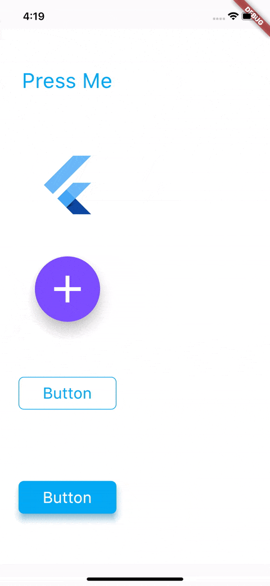

# touchable_opacity
[](https://pub.dev/packages/touchable_opacity)
[](https://travis-ci.com/nkshah2/touchable_opacity_flutter)
[](https://codecov.io/gh/nkshah2/touchable_opacity)


This package gives you access to the Touchableopacity widget. This widget uses the GestureDetector to allow interaction and animated to opacity of the widget on touch events.



### Installing

Add the package to your pubspec.yaml file

```dart
dependencies:
	touchable_opacity: 0.0.1
```

### Usage

Import the package using

```
import 'package:touchable_opacity/touchable_opacity.dart';
```

And simply use it as any other widget.

```dart
Container(
	child: TouchableOpacity(
		activeOpacity: 0.4,
		child: FlutterLogo(),
	),
),
```

### Configuration

TouchableOpacity uses gestureDetector internally and tries to maintain all the different behaviours and interactions that gesture detector enables. To understand the different touch events that you can configure please visit the GestureDetector API docs [here](https://api.flutter.dev/flutter/widgets/GestureDetector-class.html).


<b>activeOpacity</b>: double value that TouchableOpacity uses to animate the opacity of the child when a touch down event is received. The value must be between 1.0 and 0.0, the default value is 0.2 .

### Example

The code found in the example folder of this repo shows how to use this package to render the content shown in the sample GIF. The folder contains a Flutter application that you can run yourself. Go [here](example/lib/main.dart) to jump into the code.

### Support

If you have any issues with using this package, or have any ideas you thnk are good additions please create an issue [here](https://github.com/nkshah2/touchable_opacity/issues)

### Known Issues

Because of the way GestureDetector renders, TouchableOpacity fills its parent. If you want to bound the size to that of its child simply place the TouchableOpacity widget in any one of the Layout widgets, you can see a list of layout widgets available in flutter [here](https://flutter.dev/docs/development/ui/widgets/layout)
